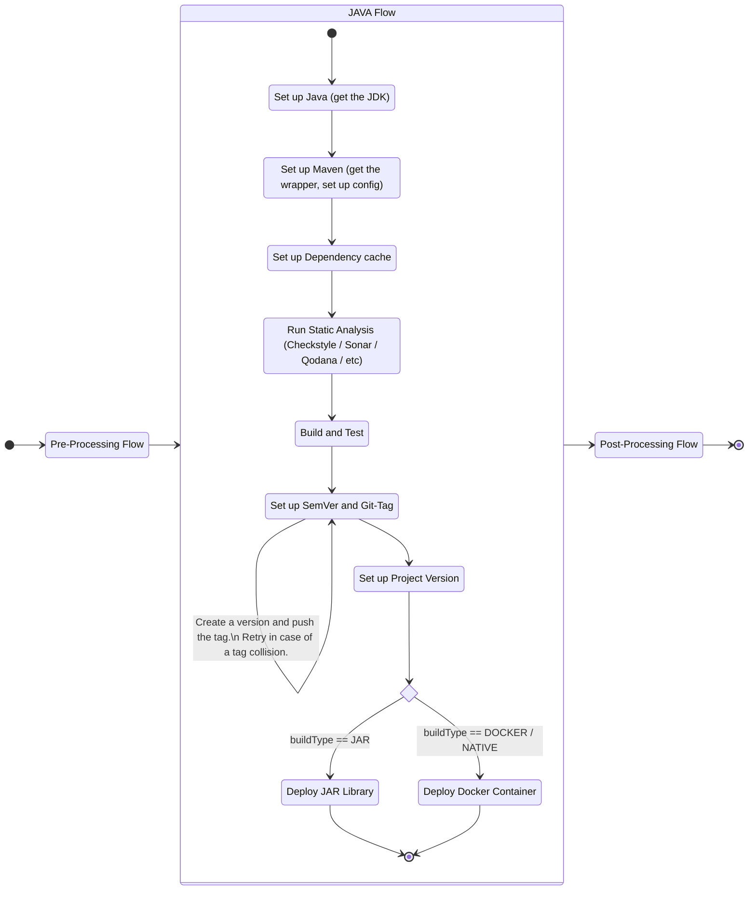

# JAVA_FLOW.md

# What

This flow is the selected one for java projects whether they are libraries or containerized applications.

# Why

Self explanatory.

# How

Each one of the actions is also self-descriptive, and if there are more insights required, they will be documented shortly as comments in the actions
themselves.

The actions used by this flow are:

- [Set up Java (get the JDK)](../actions/common/semver)
- Set up Maven (get the wrapper, setup config)
- Set up Dependency cache
- Run Static Analysis (Checkstyle / Sonar / Qodana / etc.)
- Build and Test
- Set up SemVer and Git-Tag
- Set up Project Version
- Deploy JAR Library
- Deploy Docker Container

