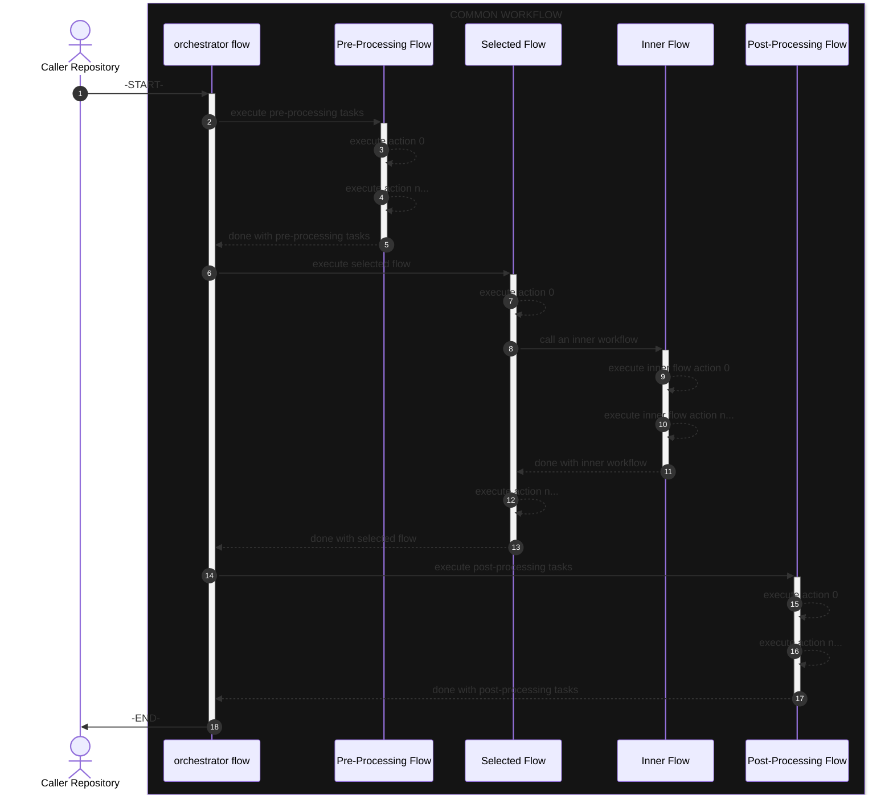
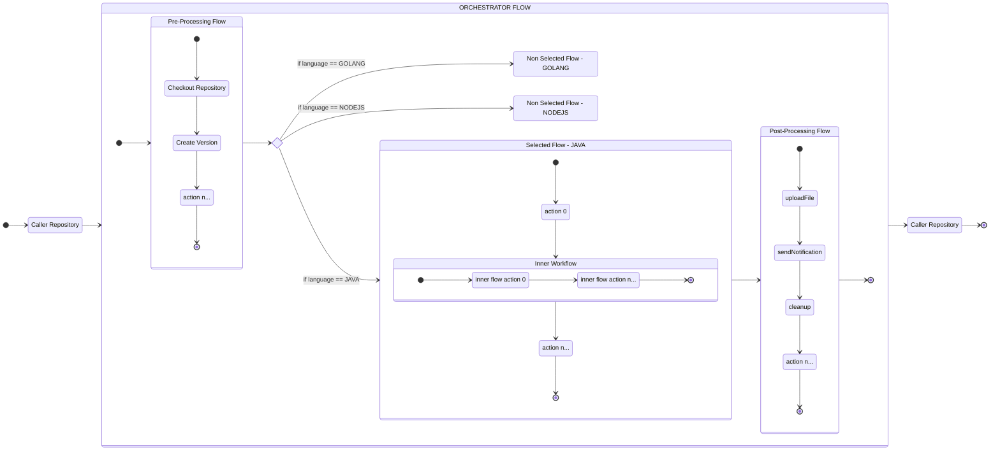

# GitHub Workflows:

This folder contains workflows to be called by the different projects.

## What (TL/DR)

The root folder contains the general flows, and inside the `implementations` folder you can find the files for each particular flow.
 Each workflow is designed to automate a full CI/CD flow determined by a given set of parameters.
 Right now the flows are determined by using the programming language as a parameter, this can evolve over time to accommodate canary builds, beta flow
testing, and other features and possible combinations of languages and build tools.

## Why

As a common theme throughout the project, this allows standardizing and reusing workflows across different projects, promoting consistency and efficiency in
development and devops processes.
 Basically, every project will call these workflows instead of implementing each one its own.

Having a common "_concierge_" workflow with decoupled implementations allows for easy maintenance and generalized updates, as well as the ability to reuse
common steps and actions across multiple workflows.

This makes the use of CI/CD by caller projects transparent to users and allows scaling to new requirements to be integrated seamlessly.

## How

The `orchestrator flow` acts as an entry point to determine which workflow to call based on a given set of parameters.
  It also contains common pre-/post-processing tasks; each one on its corresponding flow file.
  The `orchestrator flow` itself, does not contain any action, it only lists all the parameters that can be called from a project and contains the
corresponding
implementation flows with its selection logic.

### Visual representation of the workflows

#### Sequence

The events will happen as follows:

1. A `Caller Repository` workflow is triggered by some event and initiates the flow by calling the `orchestrator flow`:
    1. Each repository calls the `orchestrator flow` with a given set of options (`inputs` in GitHub parlance).
2. The `orchestrator flow` executes common `pre-processing tasks`:
    1. i.e.: check out the repo, set versions, etc.
3. The `orchestrator flow` selects the proper flow based on the provided parameters:
    1. i.e.: select `java flow`, or `Node.js + typescript flow`, etc...
4. The selected flow executes its actions and possibly calls another flow.
    1. action 0.
    2. action 1.
    3. call another flow:
        1. inner flow action 0
        2. inner flow action n...
    4. action n...
5. The `orchestrator flow` executes common `post-processing tasks`:
    1. i.e.: upload some log files, cleanup, send notification to a channel, or mail, etc.
6. The `orchestrator flow` concludes the workflow and returns a completion status.

#### Sequence Diagram

Below is a sequence of the events.

#### FlowChart Diagram

I am adding here a little more visual detail to the previous diagram.

Treat the names of the actions and workflows as examples, they can translate in the actual code or not, they are here just for added clarity.

> **Note**: Why draw a flowchart with a state diagram (_not that anyone asked at all..._)?
>
> A Mermaid flowchart does not anchor to subgraphs, forcing me to create an intricate set of subgraphs with dummy nodes inside that must receive the calls to
> render correctly.
>  You cannot also reference subgraphs declared elsewhere inside a flow as you can with states.
>  State diagrams are far easier to build, and they render cleaner and are more expressive in this particular case.

## Current Workflows:

- general:
    - [post_processing_flow.yml](post_processing_flow.yml):
        - in charge of wrapping up the pipeline run
    - [pre_processing_flow.yml](pre_processing_flow.yml):
        - in charge of all common starting actions
    - [orchestrator_flow.yml](orchestrator_flow.yml):
        - in charge of executing the pre-/post-processing flows and to execute the appropriate pipeline flow based on a given set of parameters.
- implementations:
    - [java_flow.yml](implementations/java_flow.yml)
        - in charge of executing the java-based projects pipeline.
